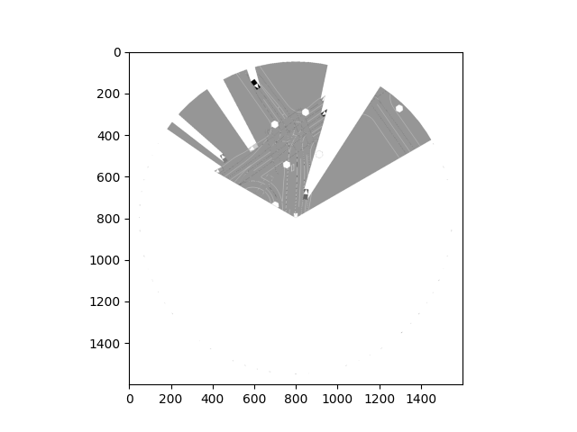
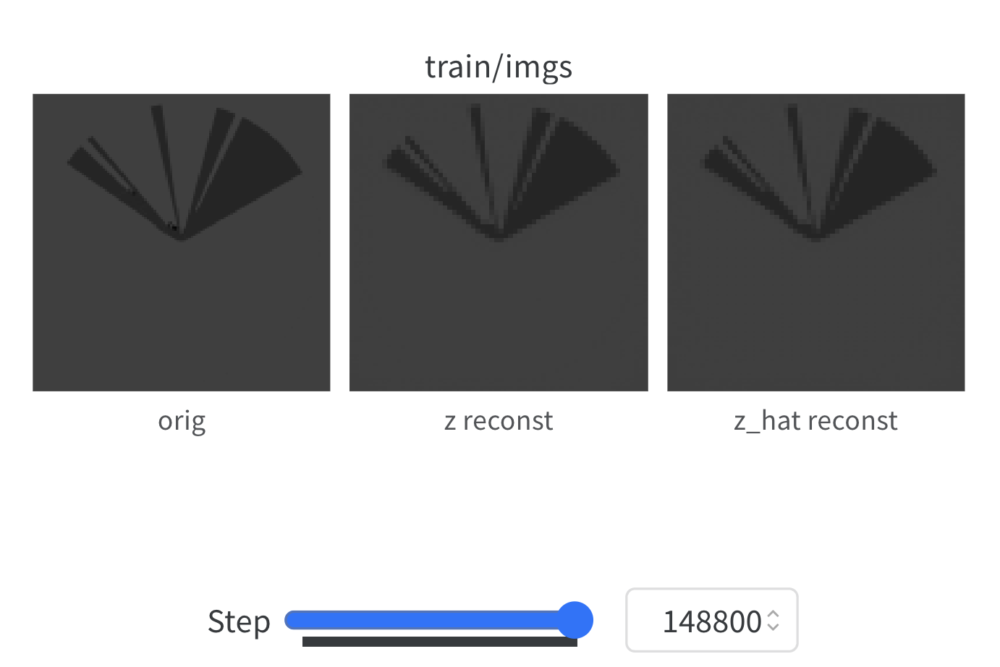

# Applying DITTO to Nocturne

This is my final report from my time at Oxford during Michaelmas 2023. Specifically, I wanted to put all of my weekly updates into a summary that reflects the entire process and motivation of the project. Most of the content may be derived from the weekly updates, but I thought it would still be helpful to consolidate all of them into one place.

## Introduction

At a high-level, my work at Oxford concerned applying [Dream Imitation](https://arxiv.org/abs/2302.03086) (DITTO) -- an off-line, imitation learning algorithm within world models -- to the [Nocturne](https://arxiv.org/abs/2206.09889) RL environment -- a 2D driving simulator for investigating multi-agent coordination under partial observability. In particular, I worked on building a world model for Nocturne as well as training both beahvior cloning (BC) and actor-critic (AC) agents on this trained world model. In terms of future work, the most low-hanging fruit is creating a more robust world model for Nocturne to run better experiments.

## Overview of Nocturne

The first part of the project involved setting up Nocturne, which is an RL environment for driving. In particular, the goal of the project is to support research in self-driving without the complications of computer vision while still modeling partial observability. More information can be found on their [repository page](https://github.com/facebookresearch/nocturne).

## Training a Behavior Cloning Agent on Nocturne

The first step of the project was training a standard Behavior Cloning agent on Nocturne and visualizing a rollout of its policy. Behavior Cloning is a part of a set of techniques known as [Imitation Learning](https://www.ri.cmu.edu/pub_files/2015/3/InvitationToImitation_3_1415.pdf), which is the study of algorithms that improve performance by observing demonstrations from a teacher. Specifically, we aim to learn a stochastic policy $\pi(a \mid s, \theta)$ that maps states to actions and learns parameters $\theta$. This policy will learn from collected human driver demonstrations and output expert actions with high likelihood. More information on the specifics of the Behavior Cloning for Nocturne can be found using [Daphne's great tutorial](https://github.com/daphnecor/nocturne/blob/intro_tutorials/docs/tutorials/03_imitation_learning.md).

To run the agent, I followed Daphne's tutorial to train a policy and saved the weights. I then wrote a [function](https://github.com/cpondoc/ditto-nocturne/blob/main/examples/test_rollout.py) that takes the same BC agent and rolls it out to a specific scenario within the Nocturne environment. Overall, since the agent only learns on such few demonstrations, the agent is not able to perform relatively well and gets derailed quite quickly.

## Overview of World Models

The second step of the project was training a world model for Nocturne. At a high-level, [world models](https://papers.nips.cc/paper_files/paper/2018/hash/2de5d16682c3c35007e4e92982f1a2ba-Abstract.html) build generative neural networks of RL enviroinments. They are trained in an unsupervised manner, and learn a compressed spatial and temporal representation of the environment. We can then use this model to train an agent, sometimes even training agent in its own dream environment and transferring the policy to the real task.

## Gathering Data for the World Model

The [DITTO](https://github.com/brantondemoss/DITTO) codebase trains a WM based on episodes of a strong [Proximal Policy Optimization](https://arxiv.org/abs/1707.06347) agent playing Breakout. Each of these files were `.npz` files and contained information containing images of the state, actions taken by the player, the total rewards gained, whether the game was reset or not, and if the state was a terminal state.

As part of the [Nocturne](https://github.com/facebookresearch/nocturne) codebase, you can download a dataset from Waymo that contains traffic scenes. Each traffic scene consists of a name, road objects and vehicles in the scene, roads, and the states of traffic lights. We can then wrap each of these traffic scenes as a Nocturne simulation, which consists of discretezed traffic scenarios that are snapshots of a traffic situation at a paricular timepoint. Each simulation lasts for 9 seconds, and they are discretized into step sizes of 0.1 seconds, meaning there are 90 total timesteps.

### Creating the dataset

For each simulation, I then followed the below procedure to generate episodes:
1. First, I loaded in the traffic simulation, and set all vehicles to be expertly controlled, which corresponds to how the cars actually moved in the real-life dataset.
2. For all of the vehicles that moved in the traffic scene, I found a vehicle that was moving (i.e., took an action) at each timestep across the entire episode. I labeled this vehicle the *ego vehicle*.
3. After finding an ego vehicle, I then retrieved its action at each timestep (Nocturne has functionality that allows you to retrieve the expert action at each timestep), and also obtained an image of the scene *from the perspective of the ego vehicle* (Figure 1).
4. Finally, I saved this data into a `.npz` file to use for training.

  
   
  Figure 1: Sample cone image from a Nocturne vehicle agent.

### A Note on the Nocturne Action Space

The action set for a vehicle consists of three components: acceleration, steering, and the head angle. Actions are discretized based on an upper and lower bound.

For the data I was looking through (the mini dataset), all of the head angles were set to 0. Thus, I only had to decide on the discretization for the acceleration and steering. In both instances, I took the following steps, I collected all of the corresponding metrics across all vehicles in all traffic scenes at each time step. Then, I generated a histogram and visualized where appropriate upper and louwer bounds would be.

After the above, I found that the acceleration could be bounded by [-6, 6], with 13 discrete buckets, and that the steering could be bounded by [-1, 1] with 21 discrete buckets.

Finally, when reporting the final action, I effectively mapped the two actions into a single action. I did this by finding an index for both the acceleration and steering index based on the bounds and discrete buckets. Since this effectively like indexing into a 2D-array, I then imagined "flattening" the 2D-array and finding the corresponding index in the now 1D-array.

## Training the World Model

In general, just to align alongside of the existing DITTO code, not much had to be changed to train a world model for Nocturne. In particular, perhaps the biggest change was defining the correct dimensionality of the action space to ensure that the function `fix_actions` would appropriately encode each action as a one-hot vector.

After training for a bit, one issue that I found was that the images were being resized into 64 by 64 pixel images. While these sizes worked for Breakout, given the vast amount of details provided in a sample Nocturne scenario, I decided to try and increase the size of the image that the model would reproduce. Specifically, I tried to [output images](https://github.com/cpondoc/DITTO/blob/d3da456d6a096ae12948fc6cadd2962f9e7d7b4a/src/data/d4rl_dataset.py#L40) of 128 by 128 pixel dimensions.

This took a bit of time and a lot of changing around, but I was able to get it done. The steps I took were the following:
- Adjusting the `cnn_depth` within [`config.py`](https://github.com/cpondoc/DITTO/blob/d3da456d6a096ae12948fc6cadd2962f9e7d7b4a/src/config/config.py#L26) of the Recurrent State Space Model (RSSM) to align with the eventual output of the encoder in the WM architecture
- Adding an [extra pair](https://github.com/cpondoc/DITTO/blob/d3da456d6a096ae12948fc6cadd2962f9e7d7b4a/src/models/decoders.py#L61) of an Activation and Transpose 2D Convolutional Layer at the end of the decoder to ensure that the output was 128 by 128

Ultimately, I found that the code was able to work, the [loss was going down](https://wandb.ai/pondoc/world-model/runs/z5zil90x/workspace?workspace=user-cpondoc), and that the images were being reconstructed (Figure 2)!

  
   
  Figure 3: Example reconstruction of Nocturne image from World Model.

