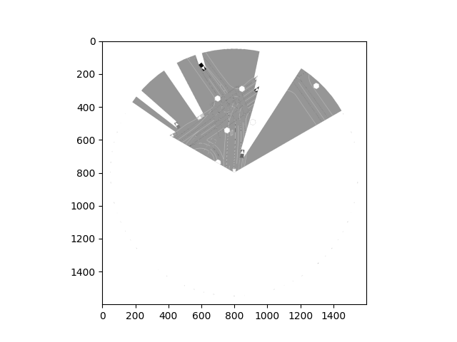

# Setting up a World Model for Nocturne

For the tutorial on November 27, 2023, I tried to set up a World Model (WM) for Nocturne. For this session and future sessions, I'll be keeping track of all my notes for accountability as well as to go over my work.

## Gathering Data

### Primer on DITTO and Nocturne Episode Data

Given the [DITTO](https://github.com/brantondemoss/DITTO) codebase, you can train a WM based on episodes of a strong PPO agent playing Breakout.
Each of these files were `.npz` files and contained information containing images of the state, actions taken by the player, the total rewards gained, whether the game was reset or not, and if the state was a terminal state. Thus, I decided to try to collect Nocturne data that was formatted in much the same way.

As part of the [Nocturne](https://github.com/facebookresearch/nocturne) codebase, you can download a dataset from Waymo that contains traffic scenes. Each traffic scene consists of a name, road objects and vehicles in the scene, roads, and the states of traffic lights. We can then wrap each of these traffic scenes as a Nocturne simulation, which consists of discretezed traffic scenarios that are snapshots of a traffic situation at a paricular timepoint. Each simulation lasts for 9 seconds, and they are discretized into step sizes of 0.1 seconds, meaning there are 90 total timesteps.

### Creating the dataset

For each simulation, I then followed the below procedure to generate episodes:
1. First, I loaded in the traffic simulation, and set all vehicles to be expertly controlled, which corresponds to how the cars actually moved in the real-life dataset.
2. For all of the vehicles that moved in the traffic scene, I found a vehicle that was moving (i.e., took an action) at each timestep across the entire episode. I labeled this vehicle the *ego vehicle*.
3. After finding an ego vehicle, I then retrieved its action at each timestep (Nocturne has functionality that allows you to retrieve the expert action at each timestep), and also obtained an image of the scene *from the perspective of the ego vehicle*.
4. Finally, I saved this data into a `.npz` file to use for training.

### A Note on the Nocturne Action Space

The action set for a vehicle consists of three components: acceleration, steering, and the head angle. Actions are discretized based on an upper and lower bound.

For the data I was looking through (the mini dataset), all of the head angles were set to 0. Thus, I only had to decide on the discretization for the acceleration and steering. In both instances, I took the following steps, I collected all of the corresponding metrics across all vehicles in all traffic scenes at each time step. Then, I generated a histogram and visualized where appropriate upper and louwer bounds would be.

After the above, I found that the acceleration could be bounded by [-6, 6], with 13 discrete buckets, and that the steering could be bounded by [-1, 1] with 21 discrete buckets.

Finally, when reporting the final action, I effectively mapped the two actions into a single action. I did this by finding an index for both the acceleration and steering index based on the bounds and discrete buckets. Since this effectively like indexing into a 2D-array, I then imagined "flattening" the 2D-array and finding the corresponding index in the now 1D-array.

## Training the World Model

I first started off by trying out the DITTO code to generate a WM for Breakout. The code was working, and I was able to visualize the WM's reconstruction of the image of the Breakout game, which was super neat.

From there, I took a stab at training a WM based on the Nocturne data that I had collected. In general, just to align alongside of the existing DITTO code, not much had to be changed. In particular, perhaps the biggest change was defining the correct dimensionality of the action space to ensure that the function `fix_actions` would appropriately encode each action as a one-hot vector.

After training for a bit, one issue that I found was that the images were being resized into 64 by 64 pixel images. While these sizes worked for breakout, given the vast amount of details provided in a sample Nocturne scenario, I decided to try and increase the size of the image that the model would reproduce. Specifically, I tried to output images of 128 by 128 pixel dimensions.

This took a bit of time and a lot of changing around, but I was able to get it done. The steps I took were the following:
- Adjusting the `cnn_depth` of the Recurrent State Space Model (RSSM) to align with the eventual output of the encoder in the WM architecture
- Adding an extra pair of an Activation and Transpose 2D Convolutional Layer at the end of the decoder to ensure that the output was 128 by 128

Ultimately, I found that the code was able to work, the loss was going down, and that the images were being reconstructed!

## Next Steps + Questions

In terms of future work, the most low-hanging fruit is: despite training for about 4 hours with the GPU, I found that the images were still *relatively low-fidelity*. That is: even compared to the downsized 128 by 128 pixel images of the original Nocturne scene, the recreations after the training the model for a couple hundred thousand steps still did not have the fidelity. Thus, I'm curious about whether or not to try:
- Even higher input image, i.e. 256 by 256?
- More CNN depth?
- Anything else?

After this, I can also start experiment with training an actor-critic.
