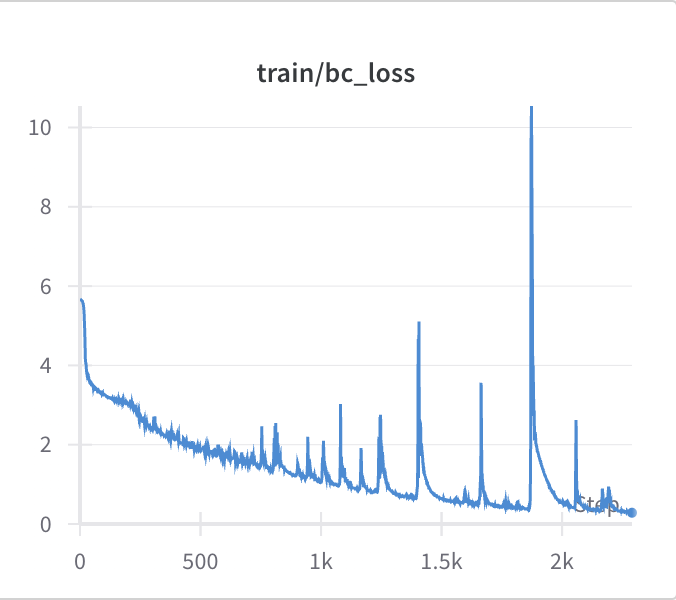

# Setting up a BC Agent for training on the Nocturne World Model

This week, I focused more on getting the code to run than on reading the papers. Specifically, I focused on fixing up some of the code and getting a Behavioral Cloning agent set up on the Nocturne World Model.

## A Segue: Setting up the Behavior Cloning Agent Code

The first objective that I set out to accomplish was to train a Behavioral Cloning agent on Nocturne.To get started, I looked at the code under the function `bc_train` in the `main.py` file, and wanted to train a BC agent on Breakout. Ultimately, I was able to get it to start working. The main issue I encountered was the `make_env` function in the `bc_trainer.py` [file](https://github.com/cpondoc/DITTO/blob/main/src/trainers/bc_trainer.py). Mainly, there seemed to be a consistent error with running `make_atari_env` from Stable Baselines 3, even when using only one environment (i.e, `n_envs = 1`). In any case, I decided to use `gymnasium` instead to create a single environment, and then simply wrapped the environment around the `AtariEnv` wrapper. I then wrote a [new function](https://github.com/cpondoc/DITTO/blob/be4f7696c664df1cb918b7dabc8b392e87a01940/src/trainers/bc_trainer.py#L166), `single_test_agent`, which makes the environment and runs a series of games to calculate validation statistics on rewards. After that change, the code was able to work.

## Training a BC Agent on the Latents

After running the code, I realized that the agent was training on the actual environment. Specifically: nowhere was the world model playing a role in any of the model's training or validation. At this point, I was redirected to the Actor-Critic training function, `ac_train`, since a BC agent was being trained on the latents as part of the training and validation of the several policies. Thus, I shifted my focus to looking at the file `ac_trainer.py` and its several functions.

After loading in the trained Nocturne World Model, training the actual BC agent on the latents worked well, as it is already a part of the training loop and is not a part of the `validate` step, where things break. The [function](https://github.com/cpondoc/DITTO/blob/be4f7696c664df1cb918b7dabc8b392e87a01940/src/trainers/ac_trainer.py#L315) `BehaviorClone` takes care of this, turning the latent observations (which are transformed by the `Featurizer` classe) into a form that can be fed into the BC Policy and then performing cross entropy loss on the distribution to calculate overall loss. In general, a [training run](https://wandb.ai/pondoc/dreamer/runs/7gip2isc?workspace=user-cpondoc) showed that the loss was indeed going down.

The difficulties I had in getting around the code were in the visualization of the rollout in the World Model, as well as getting the `validate` function to run, which are interconnected.

<p align="center">
  
  <br />
  Figure 1: Loss from BC agent trained on latents of Nocturne WM.
</p>

### Visualizing the Rollout of the BC Agent *within* the World Model

Similar to the `unroll_policy` function, I wanted to unroll the BC agent policy within the world model **on the actual latents**. Given the `BehaviorClone` function, I believe I have code in the function `BehaviorCloneRollout` that is able to [accomplish this](https://github.com/cpondoc/DITTO/blob/39d0431c69f30f8bf3e301631b453521976457b9/src/trainers/ac_trainer.py#L280): we effectively loop and get the current latent state, generate a set of actions, and then use those actions and current state to `dream`, or take a step in the world model:

```python3
# Get just the first set of latents
state = latents[0]
state = torch.reshape(state, (-1, 2048))

def gen_action(state):
    # Generate an action
    logits, action_probs = self.policy_bc.forward_actor(state)
    a_dist = Categorical(action_probs)
    a_hat = a_dist.sample()
    a_onehot = torch.eye(294).to(self.device)
    a_onehot = a_onehot[a_hat]
    return a_onehot

# Take a step in the world model
for time in range(timesteps):
    a_onehot = gen_action(state)
    state = self.wm_step(state, a_onehot)
```

However, the main issue I had alongside of this was then *visualizing* the rollout. Specifically: we only retrieve the latent states, and since there are no accompanying `features` outputted (i.e., [as seen](https://github.com/cpondoc/DITTO/blob/be4f7696c664df1cb918b7dabc8b392e87a01940/src/models/world_model.py#L56C5-L56C17) when calling the `forward` function), there is no way to visualize the decoder output.

One solution that I was planning on looking at was using the `forward` function instead. This meant updating each of the data loaders to include the observations, but I was short on time to continue going down this path.

### Generating Image Observations from Nocturne to use for Validation

The other route that would've also been informative was using the Nocturne Gym environment for validation. Similar to the `bc_trainer.py` code, `ac_trainer.py` runs a validation step that tests each agent. Part of this code is making the environment, and then taking steps from that environment. While the Nocturne does come with a Gym environment wrapper, the observations returned are not in the form of the cone images that were used to train the World Model and are flattened tensors. Thus, I tried to get the environment to spit out the corresponding [cone images](https://github.com/cpondoc/ditto-nocturne/blob/main/reports/nocturne-wm.md#creating-the-dataset) we created during the training of the Nocturne World Model.

In particular, the resulting function I was writing would've corresponded quite similar to the `single_test_agent` function I adapted (and was effectively repurposed from the old DITTO code). Like in the `generate_dataset.py` used in creating the dataset, I was planning on having the BC agent control exactly one of the cars, get their cone image observation at each step, and then seeing what action the car would've taken.

However, I kept running into too many issues trying to use this function. In particular, I kept getting a singular bug every time I tried to call the function. I didn't get this bug when running the code locally on my M1 Macbook, but I did keep getting it on the machine with the `3090`:

```
libGL error: MESA-LOADER: failed to open swrast: /usr/lib/dri/swrast_dri.so: cannot open shared object file: No such file or directory (search paths /usr/lib/x86_64-linux-gnu/dri:\$${ORIGIN}/dri:/usr/lib/dri, suffix _dri)
libGL error: failed to load driver: swrast
Failed to create an OpenGL context for this window
sfml-graphics requires support for OpenGL 1.1 or greater
Ensure that hardware acceleration is enabled if available
Failed to create texture, its internal size is too high (2048x2048, maximum is 0x0)
Impossible to create render texture (failed to create the target texture)
Trying to access the pixels of an empty image
Segmentation fault (core dumped)
```

At its core, it looks like a driver issue, specifically with regards to running visualizations. However, after trying various hacky recommendations from Stack Overflow, I was not able to figure it out.

## Looking Forward

The updated source code can be found on the [GitHub Repo](https://github.com/cpondoc/ditto-nocturne). With the remaining time I have left, training the agents and visualizing the rollouts within the world model seems like a solvable goal within the next couple of days, and I'm working with Branton to continue improving the Nocturne World Model.
